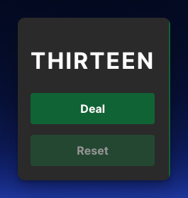
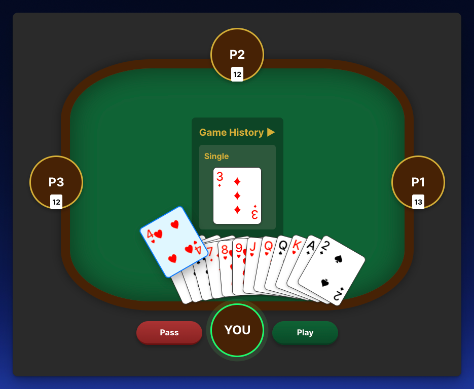
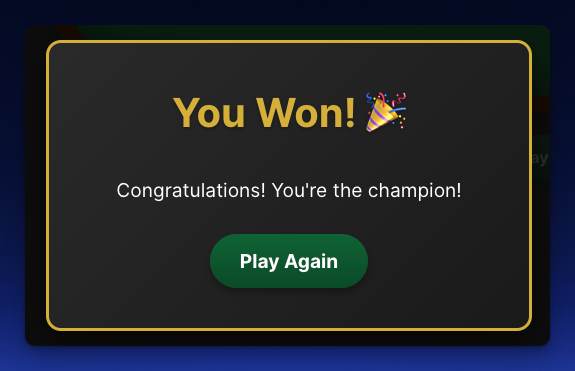

# Thirteen Card Game

A modern implementation of the classic Thirteen card game (also known as Tiến Lên or Vietnamese Poker) built with React, TypeScript, and Vite.

## 📸 Screenshots

> To add screenshots of your game, take the following photos and save them in the `public/screenshots/` directory:

_Initial game board with the Deal button_

_Active gameplay showing played cards and player hands_

_Winner celebration screen_

## 🎮 Game Overview

Thirteen is a climbing card game that originated in Vietnam. The game is played with a standard 52-card deck and typically involves 4 players. The objective is to be the first player to get rid of all your cards by playing valid card combinations.

### Key Features

- 🎲 4-player gameplay
- 🃏 Beautiful card UI
- 🔄 Real-time hand validation
- 🏆 Winner detection
- 🎯 Automatic first player detection (player with 3 of Spades)
- 📱 Responsive design

## 🎯 How to Play

1. Click the "Deal" button to start a new game
2. Cards will be dealt to all 4 players
3. The player with the 3 of Spades starts the game
4. On your turn:
   - Select valid card combinations to play
   - Click "Play" to submit your move
   - Pass if you cannot or do not want to play a higher combination
5. The game continues until one player runs out of cards

### Valid Card Combinations

- Singles: Any single card
- Pairs: Two cards of the same rank
- Triples: Three cards of the same rank
- Straights: Three or more consecutive cards
- And more complex combinations...

## 🛠️ Tech Stack

- React 18
- TypeScript
- Vite
- CSS Modules

## ✨ Future Enhancements

- [ ] Online multiplayer support
- [ ] AI opponents
- [ ] Game statistics and leaderboard
- [ ] Customizable card themes
- [ ] Sound effects and animations
